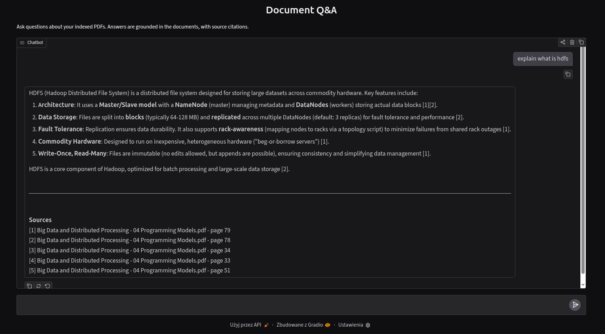

# More than just a RAG

A retrieval-augmented generation (RAG) system that answers questions about your own PDF documents. It retrieves the most relevant passages from a vector database and uses an LLM to generate answers grounded in those passages, with source and page citations.

Built to run entirely on free tools: embeddings run locally on CPU, the vector database is self-hosted, and generation uses a free-tier LLM API.

## How it works

```
PDFs ──▶ embed_data.py ──▶ Qdrant ──▶ search.py ──▶ rag.py ──▶ answer
         (parse, chunk,     (vector    (embed query,  (build context,   + citations
          embed)            store)      retrieve)      call LLM)
                                                          │
                                                       app.py (Gradio UI)
```

1. **Ingestion** (`embed_data.py`) - PDFs are loaded page by page, split into chunks that fit the embedding model's token limit, embedded locally with a BGE model, and upserted into Qdrant. Chunk IDs are deterministic, so re-running updates existing chunks in place and adds new ones without creating duplicates.
2. **Retrieval** (`search.py`) - your question is embedded with the same model, and the most similar chunks are pulled from Qdrant.
3. **Generation** (`rag.py`) - the retrieved chunks are passed to the LLM with instructions to answer using only that context and to cite the sources by number.
4. **UI** (`app.py`) - a Gradio chat interface ties it together and shows which file and page each answer came from.

## Preview 



## Stack

- **Language:** Python 3.14, managed with [uv](https://docs.astral.sh/uv/)
- **Vector database:** [Qdrant](https://qdrant.tech/)
- **Embeddings:** `BAAI/bge-base-en-v1.5` (768-dim), run locally on CPU via `sentence-transformers`
- **LLM:** Qwen3-32B via [Groq](https://groq.com/) (free tier), through [LiteLLM](https://docs.litellm.ai/) for provider-agnostic calls
- **PDF parsing:** PyMuPDF
- **UI:** Gradio
- **Containerization:** Docker + Docker Compose

PyTorch is pinned to the CPU-only build (no CUDA), since only the embedding model runs locally and it doesn't need a GPU.

## Prerequisites

- Docker and Docker Compose
- A free Groq API key - sign up at [console.groq.com](https://console.groq.com) (no credit card required)
- Optional, only if running the app outside Docker: [uv](https://docs.astral.sh/uv/getting-started/installation/)

## Setup

**1. Configure your API key**

```bash
cp .env.example .env
```
Open `.env` and paste in your Groq key:
```
GROQ_API_KEY=your_key_here
```

**2. Add your documents**

Drop the PDFs you want to query into the `data/` folder:
```bash
cp /path/to/your/*.pdf data/
```

**3. Build and start the stack**

```bash
docker compose up --build
```
This builds the app image and starts both Qdrant and the app. The first build takes a few minutes (downloading dependencies); later builds are cached and fast.

**4. Index your documents**

In another terminal, run the ingestion as a one-off task:
```bash
docker compose run --rm app uv run python embed_data.py
```
The first run downloads the embedding model (~400 MB) into a cached volume. You'll see how many chunks were indexed.

**5. Open the app**

Go to **http://localhost:7860** and start asking questions.
The Qdrant dashboard is available at **http://localhost:6333/dashboard** if you want to inspect what's stored.

## Usage

### Adding or updating documents

Drop new PDFs into `data/` and re-run ingestion:
```bash
docker compose run --rm app uv run python embed_data.py
```
Because chunk IDs are deterministic, this updates existing chunks and adds new ones - no duplicates. The indexed vectors persist in the `qdrant_storage` volume across restarts, so you only re-ingest when documents change.

### Rebuilding the index from scratch

Use `--reset` after changing the embedding model, vector dimension, or chunking strategy (it deletes everything indexed and rebuilds):
```bash
docker compose run --rm app uv run python embed_data.py --reset
```

### Querying from the command line

The retrieval and full RAG pipeline can also be run directly:
```bash
docker compose run --rm app uv run python search.py "your query"   # show retrieved chunks
docker compose run --rm app uv run python rag.py "your question"   # full answer with citations
```

## Running without Docker (local development)

Useful for faster iteration on the app code. You still run Qdrant in Docker. Note that `uv sync` and `docker compose` run from the project **root**, but the scripts run from inside **`src/`** (where the modules live):

```bash
uv sync                          # at the root: install dependencies
docker compose up -d qdrant      # at the root: start just the vector database
cd src                           # the scripts expect src/ as the working directory
uv run python embed_data.py      # index your PDFs (talks to localhost:6333)
uv run python app.py             # start the UI at http://localhost:7860
```
`db.py` falls back to `http://localhost:6333` when `QDRANT_URL` isn't set, so the same code works both on the host and inside the container.

## Project structure

```
.
├── src/
│   ├── db.py            # Qdrant client, shared config, collection management
│   ├── embed_data.py    # ingestion: PDFs → chunks → embeddings → Qdrant
│   ├── search.py        # retrieval: query → similar chunks
│   ├── rag.py           # retrieval + LLM → grounded, cited answer
│   └── app.py           # Gradio chat UI
├── data/                # your PDFs (gitignored)
├── Dockerfile           # app image (uv-based, CPU-only torch)
├── docker-compose.yml   # Qdrant + app services
├── pyproject.toml       # dependencies and CPU-torch index config
├── .env.example         # template for GROQ_API_KEY
├── .gitignore
├── .dockerignore
└── README.md
```

## Configuration

Most settings live in `src/db.py` as a single source of truth:

| Setting | Location | Default |
|---|---|---|
| Collection name | `src/db.py` | `documents` |
| Embedding model | `src/db.py` | `BAAI/bge-base-en-v1.5` |
| Vector dimension | `src/db.py` | `768` (must match the model) |
| Qdrant URL | env / `src/db.py` | `http://localhost:6333` |
| Chunk size | `src/embed_data.py` | `800` characters |
| LLM model | `src/rag.py` | `groq/qwen/qwen3-32b` |

If you change the embedding model, update the vector dimension to match and re-ingest with `--reset`.

## Notes

- **Ingestion needs no API key** - only embedding (local) and Qdrant are involved. The Groq key is required only for the chat/answer step.
- **The LLM is swappable.** Thanks to LiteLLM, changing the model in `src/rag.py` (e.g. to a local Ollama model or a different provider) is a one-line change.
- **The "Not secure" browser label is expected** for local `http://localhost` - the traffic never leaves your machine. HTTPS is handled automatically if you later deploy to a host like Hugging Face Spaces.

## Troubleshooting

- **`Connection refused` from Qdrant** - the app can't reach the database. In Docker the app talks to Qdrant at `http://qdrant:6333` (service name), set via `QDRANT_URL` in `docker-compose.yml`; on the host it falls back to `localhost:6333`. Make sure Qdrant is running.
- **`ERR_CONNECTION_RESET` in the browser** - make sure you're using `http://` (not `https://`) and that the app finished starting (`docker compose logs app` should show `Running on http://0.0.0.0:7860`).
- **"No collection" / empty results** - you haven't ingested yet, or ingested into a different collection. Run the ingestion step.